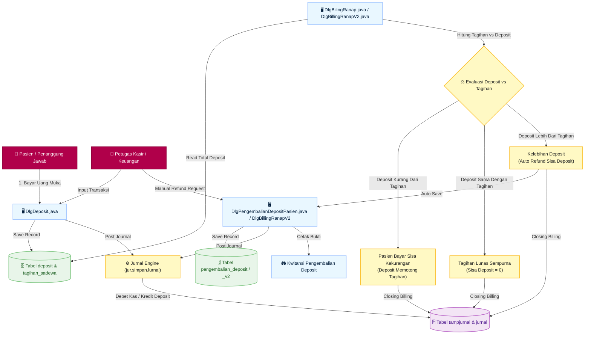
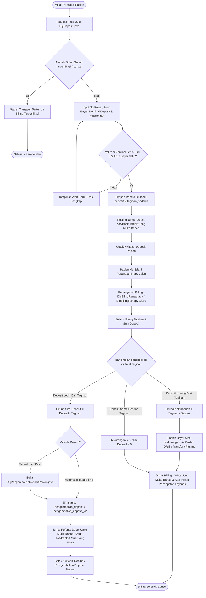
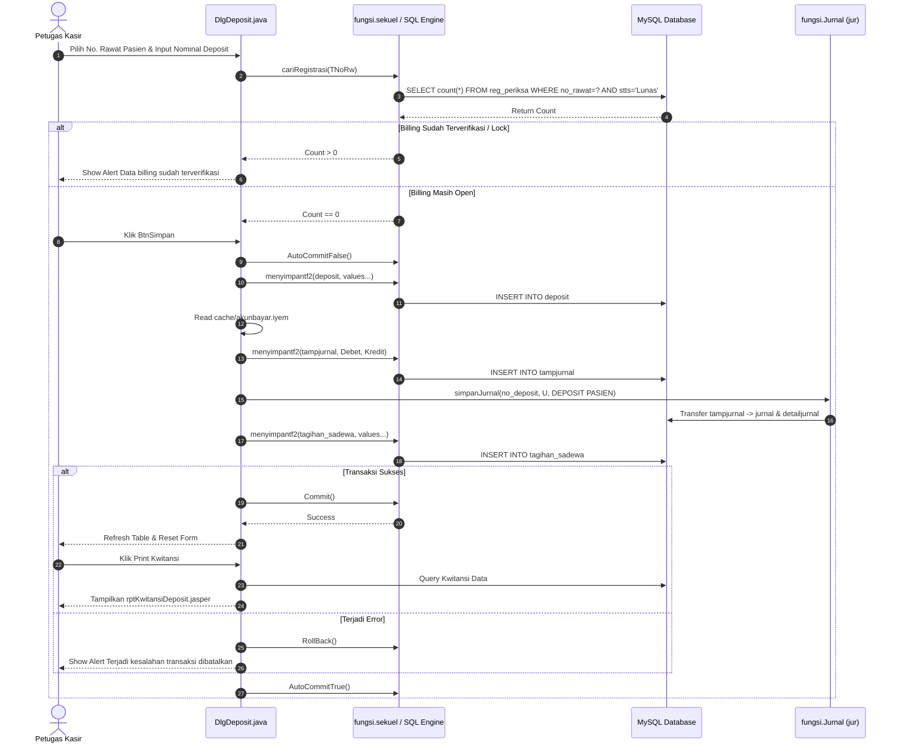
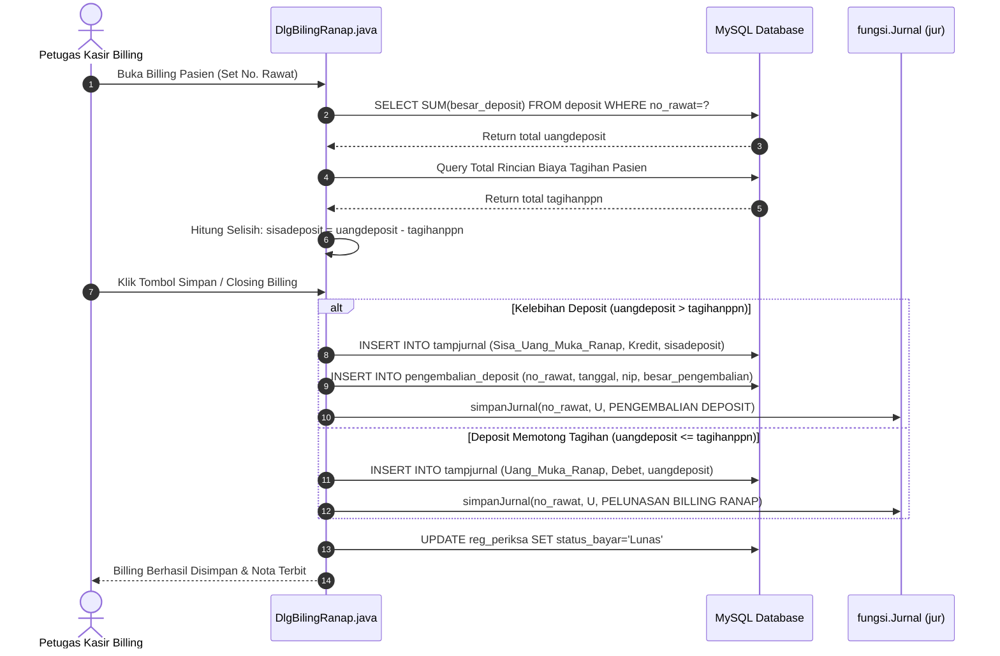
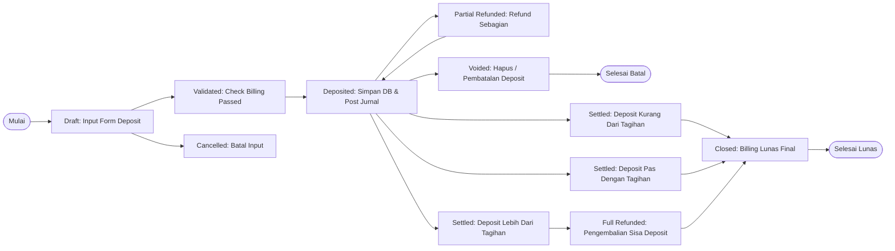
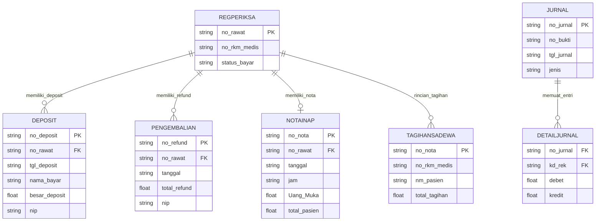

# System Flow Diagram: Proses Deposit & Refund Pasien (SIMRS Khanza)

Dokumen ini menjelaskan arsitektur teknis, diagram alur sistem (*System Flow Diagram*), diagram urutan (*Sequence Diagram*), transisi status (*State Diagram*), aturan bisnis (*Business Rules*), serta pencatatan jurnal akuntansi untuk proses **Deposit** dan **Refund (Pengembalian Deposit)** pasien pada aplikasi SIMRS Khanza (khususnya terintegrasi dengan modul `DlgBilingRanap.java`, `DlgDeposit.java`, `DlgPengembalianDepositPasien.java`, dan `DlgBillingRanapV2.java`).

---

## 1. Arsitektur & Gambaran Umum Sistem

Proses Pengelolaan Deposit dan Refund Pasien di SIMRS Khanza menghubungkan modul Kasir Keuangan, Pelayanan Rawat Inap/Jalan, dan Sistem Akuntansi Otomatis (General Ledger).

---

## 2. End-to-End System Flowchart (Proses Utama)

Berikut adalah diagram alur proses sistem (*System Flowchart*) dari penerimaan deposit pasien awal, perhitungan saat pasien pulang (billing closure), hingga pengembalian sisa deposit (refund):

---

## 3. Detailed Sequence Diagrams

### 3.1 Sequence Diagram: Penerimaan Deposit Pasien (`DlgDeposit.java`)

---

### 3.2 Sequence Diagram: Penggunaan Deposit & Auto-Refund pada Billing Ranap (`DlgBilingRanap.java`)

---

## 4. State Transition Diagram: Siklus Hidup Transaksi Deposit

Diagram berikut menjelaskan perubahan status (*State Transitions*) uang deposit pasien dari saat disetorkan hingga diselesaikan:

---

## 5. Matriks Jurnal Akuntansi (Accounting Entries Matrix)

Pencatatan akuntansi SIMRS Khanza menggunakan metode *Double-Entry Bookkeeping* yang dicatat melalui tabel perantara `tampjurnal` lalu dibukukan ke tabel `jurnal` dan `detailjurnal`:

| No | Skenario Transaksi | Kode / Nama Rekening | Posisi | Penjelasan Fungsi Jurnal |
|---|---|---|---|---|
| **1** | **Penerimaan Deposit Pasien** (`DlgDeposit.java`) | `[KodeRek Bayar]` (misal: Kas Kasir / Rek. Bank) | **DEBET** | Bertambahnya kas/bank dari setoran deposit pasien |
| | | `Uang_Muka_Ranap` (Akun Deposit Pasien) | **KREDIT** | Kewajiban RS atas titipan uang muka pasien |
| **2** | **Penggunaan Deposit pada Billing** (`DlgBilingRanap.java`) | `Uang_Muka_Ranap` (Akun Deposit Pasien) | **DEBET** | Pelunasan/penurunan kewajiban deposit yang dipakai |
| | | `[KodeRek Pendapatan]` (Kamar, Tindakan, Obat, dll) | **KREDIT** | Pengakuan pendapatan pelayanan RS dari deposit |
| **3** | **Kekurangan Tagihan (Pembayaran Sisa)** (`Deposit < Tagihan`) | `[KodeRek Bayar Pelunasan]` / `Piutang Pasien` | **DEBET** | Kas masuk / piutang atas sisa tagihan yang belum tertutup deposit |
| | | `[KodeRek Pendapatan]` | **KREDIT** | Pengakuan sisa pendapatan |
| **4** | **Refund Sisa Deposit / Refund Manual** (`DlgPengembalianDepositPasien.java`) | `Uang_Muka_Ranap` / `Sisa_Uang_Muka_Ranap` | **DEBET** | Pengurangan akun deposit/sisa uang muka |
| | | `[KodeRek Kas/Bank Pengembalian]` | **KREDIT** | Kas/Bank keluar dikembalikan ke pasien |
| | | `[KodeRek Admin]` (Jika ada admin pada V2) | **KREDIT** | Pendapatan biaya administrasi pencairan refund |
| **5** | **Pembatalan Deposit (Void Transaksi)** | `Uang_Muka_Ranap` | **DEBET** | Membalikkan kewajiban deposit yang dibatalkan |
| | | `[KodeRek Bayar]` | **KREDIT** | Membalikkan kas/bank yang batal diterima |

---

## 6. Structure & Entity Relationship Database Schema

Berikut struktur hubungan antar tabel (*ER-Diagram*) terkait deposit dan refund di SIMRS Khanza:

---

## 7. Lokasi File & Referensi Modul Java

- **Penerimaan Deposit**: [`src/keuangan/DlgDeposit.java`](file:///C:/Users/Christopher%20Jonathan/Documents/Project/SIMRSKhanza%20Custom%20Toper/src/keuangan/DlgDeposit.java)
- **Billing Rawat Inap Main**: [`src/keuangan/DlgBilingRanap.java`](file:///C:/Users/Christopher%20Jonathan/Documents/Project/SIMRSKhanza%20Custom%20Toper/src/keuangan/DlgBilingRanap.java)
- **Billing Rawat Inap V2**: [`src/keuangan/DlgBillingRanapV2.java`](file:///C:/Users/Christopher%20Jonathan/Documents/Project/SIMRSKhanza%20Custom%20Toper/src/keuangan/DlgBillingRanapV2.java)
- **Pengembalian Deposit Legacy**: [`src/keuangan/DlgPengembalianDepositPasien.java`](file:///C:/Users/Christopher%20Jonathan/Documents/Project/SIMRSKhanza%20Custom%20Toper/src/keuangan/DlgPengembalianDepositPasien.java)
- **Pengaturan Rekening Akun**: [`src/keuangan/DlgPengaturanRekening.java`](file:///C:/Users/Christopher%20Jonathan/Documents/Project/SIMRSKhanza%20Custom%20Toper/src/keuangan/DlgPengaturanRekening.java)
