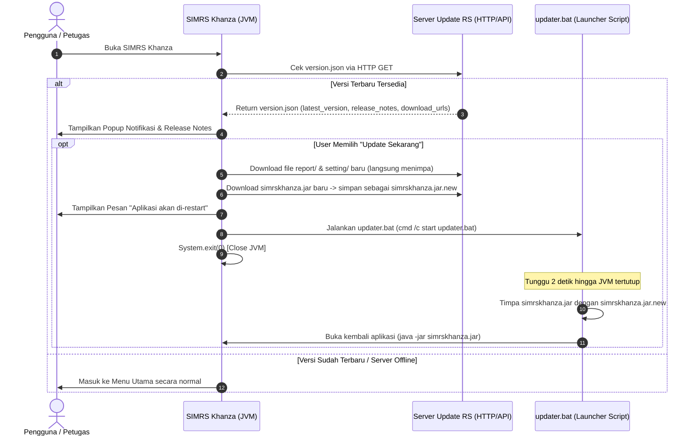

# Rencana Implementasi Auto-Updater SIMRS Khanza

Dokumen ini berisi panduan dan rencana teknis untuk mengimplementasikan fitur **Pendeteksi & Pembaru Otomatis (Auto-Updater)** di SIMRS Khanza. Fitur ini dirancang untuk mempermudah distribusi pembaruan file `.jar`, file cetakan JasperReports (`.jasper`/`.jrxml`), dan konfigurasi (`setting/`) secara otomatis dengan skema *Agile*.

---

## 1. Arsitektur & Alur Kerja



---

## 2. Rincian Komponen yang Dibutuhkan

| No | Komponen | Lokasi File | Deskripsi / Fungsi |
|---|---|---|---|
| 1 | Manifest Server | `http://<IP_SERVER>/updates/version.json` | Menyediakan metadata versi terbaru, log perubahan, dan daftar URL file yang perlu di-update. |
| 2 | Class AutoUpdater | `src/fungsi/AutoUpdater.java` | Logika background thread pembanding versi, GUI notifikasi, dan downloader. |
| 3 | Helper Launcher | `updater.bat` (di root SIMRS Client) | Script Batch penukar file JAR dan penutup/pembuka ulang aplikasi. |
| 4 | Main Class Hook | `src/simrskhanza/SIMRSKhanza.java` atau `frmUtama.java` | Menginisialisasi pemanggilan `AutoUpdater.checkUpdate()` saat aplikasi dibuka. |

---

## 3. Langkah-Langkah Eksekusi & Detail Kode

### Langkah 1: Buat Server Manifest (`version.json`)
Sediakan file JSON di web server lokal RS (misal: Apache / Nginx / Node.js):

```json
{
  "latest_version": "2026.07.29",
  "min_required_version": "2026.01.01",
  "release_notes": "1. Penambahan Modul Asesmen IGD Baru\n2. Perbaikan Cetakan Billing Kasir\n3. Update Setting Bridging BPJS",
  "jar_url": "http://192.168.1.100/updates/simrskhanza.jar",
  "reports": [
    {
      "file_path": "report/rptIGD.jasper",
      "download_url": "http://192.168.1.100/updates/report/rptIGD.jasper"
    }
  ],
  "settings": [
    {
      "file_path": "setting/database.xml",
      "download_url": "http://192.168.1.100/updates/setting/database.xml"
    }
  ]
}
```

---

### Langkah 2: Buat Class `fungsi.AutoUpdater.java`

Buat file baru di `src/fungsi/AutoUpdater.java`:

```java
package fungsi;

import java.io.*;
import java.net.HttpURLConnection;
import java.net.URL;
import javax.swing.JOptionPane;
import javax.swing.SwingUtilities;

/**
 * Auto-Updater Module untuk SIMRS Khanza
 */
public class AutoUpdater {
    // Versi lokal aplikasi saat ini
    public static final String CURRENT_VERSION = "2026.07.25";
    
    // URL Server Update RS
    private static final String VERSION_URL = "http://192.168.1.100/updates/version.json";
    private static final String JAR_UPDATE_URL = "http://192.168.1.100/updates/simrskhanza.jar";

    public static void checkUpdateAsync() {
        Thread updateThread = new Thread(() -> {
            try {
                // Beri delay 3 detik agar GUI utama muncul lebih dulu tanpa nge-lag
                Thread.sleep(3000);
                
                String jsonContent = fetchStringFromUrl(VERSION_URL);
                if (jsonContent.isEmpty()) return;

                // Simple JSON Parsing (Tanpa dependensi external berat)
                String latestVersion = parseJsonValue(jsonContent, "latest_version");
                String releaseNotes = parseJsonValue(jsonContent, "release_notes");

                if (isNewerVersion(latestVersion, CURRENT_VERSION)) {
                    SwingUtilities.invokeLater(() -> {
                        int choice = JOptionPane.showConfirmDialog(
                            null,
                            "Versi Baru SIMRS Khanza (" + latestVersion + ") Tersedia!\n\n" +
                            "Catatan Pembaruan:\n" + releaseNotes.replace("\\n", "\n") + "\n\n" +
                            "Apakah Anda ingin memperbarui aplikasi sekarang?",
                            "Pembaruan SIMRS Khanza",
                            JOptionPane.YES_NO_OPTION,
                            JOptionPane.INFORMATION_MESSAGE
                        );

                        if (choice == JOptionPane.YES_OPTION) {
                            new Thread(() -> performUpdate()).start();
                        }
                    });
                }
            } catch (Exception e) {
                System.err.println("[AutoUpdater] Log Error: " + e.getMessage());
            }
        });
        updateThread.setDaemon(true);
        updateThread.start();
    }

    private static void performUpdate() {
        try {
            // 1. Download JAR Baru ke temporary file
            System.out.println("[AutoUpdater] Mengunduh simrskhanza.jar.new...");
            downloadFile(JAR_UPDATE_URL, "simrskhanza.jar.new");

            // 2. Beri info ke user
            SwingUtilities.invokeLater(() -> {
                JOptionPane.showMessageDialog(
                    null,
                    "Pembaruan selesai diunduh.\nAplikasi akan menutup dan memperbarui file launcher.",
                    "Informasi Update",
                    JOptionPane.INFORMATION_MESSAGE
                );

                try {
                    // 3. Jalankan updater.bat lalu shutdown JVM
                    Runtime.getRuntime().exec("cmd /c start updater.bat");
                    System.exit(0);
                } catch (IOException ex) {
                    JOptionPane.showMessageDialog(null, "Gagal menjalankan updater.bat: " + ex.getMessage());
                }
            });

        } catch (Exception e) {
            SwingUtilities.invokeLater(() -> {
                JOptionPane.showMessageDialog(null, "Gagal melakukan update: " + e.getMessage(), "Error Update", JOptionPane.ERROR_MESSAGE);
            });
        }
    }

    private static boolean isNewerVersion(String serverVer, String currentVer) {
        if (serverVer == null || serverVer.isEmpty()) return false;
        return serverVer.compareTo(currentVer) > 0;
    }

    private static String fetchStringFromUrl(String urlString) throws IOException {
        URL url = new URL(urlString);
        HttpURLConnection conn = (HttpURLConnection) url.openConnection();
        conn.setConnectTimeout(5000);
        conn.setReadTimeout(5000);
        conn.setRequestMethod("GET");

        if (conn.getResponseCode() != HttpURLConnection.HTTP_OK) {
            return "";
        }

        BufferedReader reader = new BufferedReader(new InputStreamReader(conn.getInputStream(), "UTF-8"));
        StringBuilder sb = new StringBuilder();
        String line;
        while ((line = reader.readLine()) != null) {
            sb.append(line);
        }
        reader.close();
        return sb.toString();
    }

    private static void downloadFile(String fileURL, String savePath) throws IOException {
        URL url = new URL(fileURL);
        HttpURLConnection conn = (HttpURLConnection) url.openConnection();
        conn.setConnectTimeout(10000);
        conn.setReadTimeout(30000);

        if (conn.getResponseCode() == HttpURLConnection.HTTP_OK) {
            InputStream inputStream = conn.getInputStream();
            FileOutputStream outputStream = new FileOutputStream(savePath);

            byte[] buffer = new byte[8192];
            int bytesRead;
            while ((bytesRead = inputStream.read(buffer)) != -1) {
                outputStream.write(buffer, 0, bytesRead);
            }

            outputStream.close();
            inputStream.close();
        } else {
            throw new IOException("Server merespons kode: " + conn.getResponseCode());
        }
    }

    private static String parseJsonValue(String json, String key) {
        String searchKey = "\"" + key + "\":\"";
        int start = json.indexOf(searchKey);
        if (start == -1) {
            searchKey = "\"" + key + "\": \"";
            start = json.indexOf(searchKey);
            if (start == -1) return "";
        }
        start += searchKey.length();
        int end = json.indexOf("\"", start);
        if (end == -1) return "";
        return json.substring(start, end);
    }
}
```

---

### Langkah 3: Buat Script Launcher `updater.bat`

Buat file `updater.bat` di direktori utama SIMRS Khanza (sejajar dengan `simrskhanza.jar`):

```bat
@echo off
title Pembaruan SIMRS Khanza
echo ====================================================
echo             PROSES PEMBARUAN SIMRS KHANZA
echo ====================================================
echo Memproses penggantian file, mohon tidak menutup jendela ini...

:: Tunggu 2 detik agar proses Java benar-benar tertutup
timeout /t 2 /nobreak > nul

:: Timpa simrskhanza.jar lama jika file baru tersedia
if exist simrskhanza.jar.new (
    echo Mengganti simrskhanza.jar dengan versi terbaru...
    move /y simrskhanza.jar.new simrskhanza.jar
)

echo Pembaruan Berhasil! Membuka kembali SIMRS Khanza...
start java -jar simrskhanza.jar

exit
```

---

### Langkah 4: Hook di `frmUtama.java` atau `SIMRSKhanza.java`

Tambahkan pemanggilan di `src/simrskhanza/SIMRSKhanza.java` atau di konstruktor/`windowOpened` event pada `frmUtama.java`:

```java
// Di dalam method main() atau setelah GUI utama tampil:
fungsi.AutoUpdater.checkUpdateAsync();
```

---

## 4. Rencana Pengujian (Testing & Verification Plan)

| ID | Kasus Uji | Skenario | Hasil yang Diharapkan |
|---|---|---|---|
| TC-01 | Server Offline / Timeout | Matikan web server update, lalu jalankan SIMRS Khanza. | Aplikasi tetap terbuka normal tanpa error/freeze. |
| TC-02 | Versi Sama / Lebih Lama | Atur `latest_version` di server = `"2026.07.25"`. | Tidak muncul notifikasi update. |
| TC-03 | Versi Baru Tersedia | Atur `latest_version` di server = `"2026.07.29"`. | Notifikasi popup & release notes muncul. |
| TC-04 | User Memilih "Nanti" | Klik tombol "No" pada dialog update. | Dialog tertutup dan user dapat melanjutkan bekerja. |
| TC-05 | Eksekusi Update Lengkap | Klik tombol "Yes" pada dialog update. | Application men-download `.new`, menutup SIMRS, memanggil `updater.bat`, menimpa `.jar`, dan membuka kembali SIMRS otomatis. |

---

## 5. Checklist Eksekusi Besok

- [ ] 1. Siapkan endpoint HTTP/Web Server lokal RS (misal: Apache/Nginx di `192.168.1.100`) dan letakkan file test `version.json`.
- [ ] 2. Buat file `src/fungsi/AutoUpdater.java` pada project NetBeans SIMRS Khanza.
- [ ] 3. Panggil `AutoUpdater.checkUpdateAsync()` pada `SIMRSKhanza.java` / `frmUtama.java`.
- [ ] 4. Buat file `updater.bat` di root direktori project/dist.
- [ ] 5. Clean & Build SIMRS Khanza.
- [ ] 6. Jalankan simulasi update sesuai tabel pengujian.

---
*Dokumen ini dibuat otomatis oleh AI Antigravity untuk persiapan eksekusi pembaruan SIMRS Khanza.*
