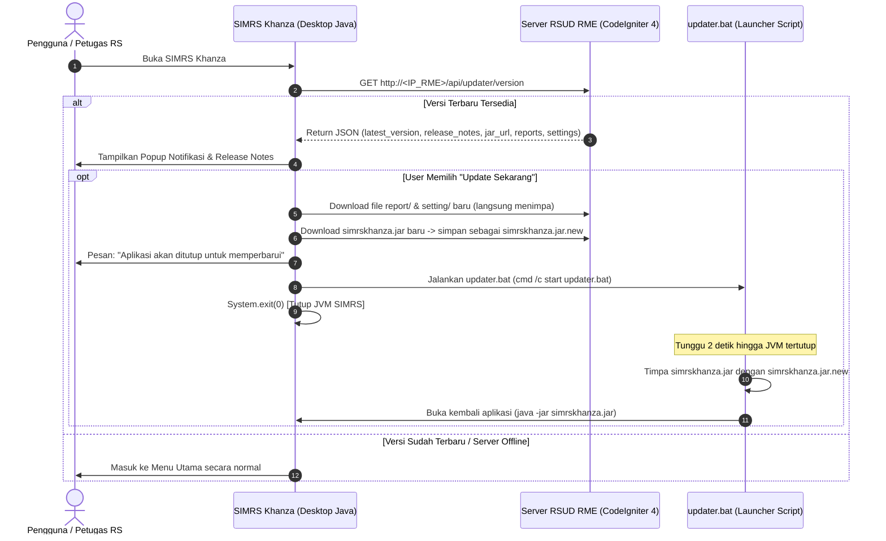

# Rencana Implementasi Auto-Updater SIMRS Khanza (Terintegrasi dengan RSUD RME)

Dokumen ini berisi panduan dan rencana teknis untuk mengimplementasikan fitur **Pendeteksi & Pembaru Otomatis (Auto-Updater)** di SIMRS Khanza, di mana server pembaruannya disatukan langsung ke dalam web application **RSUD RME (CodeIgniter 4)**.

---

## 1. Arsitektur & Alur Kerja



---

## 2. Rincian Komponen & Integrasi RSUD RME

| No | Komponen | Lokasi File | Deskripsi / Fungsi |
|---|---|---|---|
| 1 | **RME API Controller** | `rsudrme/app/Controllers/Api/Updater.php` | Controller CodeIgniter 4 penyedia JSON info versi terbaru. |
| 2 | **RME Route** | `rsudrme/app/Config/Routes.php` | Routing endpoint: `GET /api/updater/version`. |
| 3 | **RME Public Assets** | `rsudrme/public/updates/` | Folder publik tempat menyimpan file `simrskhanza.jar`, `.jasper`, dan `database.xml`. |
| 4 | **SIMRS AutoUpdater** | `src/fungsi/AutoUpdater.java` | Class Java pembaca API RME, pembuka notifikasi, & downloader. |
| 5 | **Launcher Script** | `updater.bat` (di root SIMRS Khanza) | Script penukar file `.jar` dan pembuka ulang aplikasi. |

---

## 3. Detail Kode Implementasi

### Bagian A: Integrasi di RSUD RME (CodeIgniter 4 Backend)

#### 1. Buat Controller API `app/Controllers/Api/Updater.php`
```php
<?php

namespace App\Controllers\Api;

use CodeIgniter\RESTful\ResourceController;

class Updater extends ResourceController
{
    protected $format = 'json';

    public function version()
    {
        $baseUrl = base_url('updates/');

        $response = [
            'latest_version'       => '2026.07.29',
            'min_required_version' => '2026.01.01',
            'release_notes'        => "1. Modul Asesmen IGD Terbaru\n2. Perbaikan Cetakan Billing Ralan\n3. Bridging BPJS Versi Baru",
            'jar_url'              => $baseUrl . 'simrskhanza.jar',
            'reports'              => [
                [
                    'file_path'    => 'report/rptIGD.jasper',
                    'download_url' => $baseUrl . 'report/rptIGD.jasper'
                ]
            ],
            'settings'             => [
                [
                    'file_path'    => 'setting/database.xml',
                    'download_url' => $baseUrl . 'setting/database.xml'
                ]
            ]
        ];

        return $this->respond($response);
    }
}
```

#### 2. Tambahkan Route di `app/Config/Routes.php`
```php
$routes->group('api', function($routes) {
    $routes->get('updater/version', 'Api\Updater::version');
});
```

#### 3. Struktur Folder Penyimpanan File Update di RSUD RME
Letakkan file pembaruan di folder `public` RSUD RME:
```
rsudrme/
└── public/
    └── updates/
        ├── simrskhanza.jar
        ├── report/
        │   └── rptIGD.jasper
        └── setting/
            └── database.xml
```

---

### Bagian B: Client SIMRS Khanza (Desktop Java)

#### 1. Buat Class `src/fungsi/AutoUpdater.java`
```java
package fungsi;

import java.io.*;
import java.net.HttpURLConnection;
import java.net.URL;
import javax.swing.JOptionPane;
import javax.swing.SwingUtilities;

/**
 * Auto-Updater Module SIMRS Khanza via RSUD RME Server
 */
public class AutoUpdater {
    // Versi lokal SIMRS Khanza saat ini
    public static final String CURRENT_VERSION = "2026.07.25";
    
    // URL Endpoint API RSUD RME
    private static final String RME_UPDATE_API = "http://192.168.1.100/api/updater/version";
    private static final String JAR_UPDATE_URL = "http://192.168.1.100/updates/simrskhanza.jar";

    public static void checkUpdateAsync() {
        Thread updateThread = new Thread(() -> {
            try {
                // Delay 3 detik agar aplikasi terbuka lancar
                Thread.sleep(3000);
                
                String jsonContent = fetchStringFromUrl(RME_UPDATE_API);
                if (jsonContent.isEmpty()) return;

                String latestVersion = parseJsonValue(jsonContent, "latest_version");
                String releaseNotes = parseJsonValue(jsonContent, "release_notes");

                if (isNewerVersion(latestVersion, CURRENT_VERSION)) {
                    SwingUtilities.invokeLater(() -> {
                        int choice = JOptionPane.showConfirmDialog(
                            null,
                            "Pembaruan SIMRS Khanza (" + latestVersion + ") Tersedia di Server RSUD RME!\n\n" +
                            "Catatan Pembaruan:\n" + releaseNotes.replace("\\n", "\n") + "\n\n" +
                            "Apakah Anda ingin memperbarui aplikasi sekarang?",
                            "Pembaruan SIMRS Khanza",
                            JOptionPane.YES_NO_OPTION,
                            JOptionPane.INFORMATION_MESSAGE
                        );

                        if (choice == JOptionPane.YES_OPTION) {
                            new Thread(() -> performUpdate()).start();
                        }
                    });
                }
            } catch (Exception e) {
                System.err.println("[AutoUpdater] Gagal cek versi ke RSUD RME: " + e.getMessage());
            }
        });
        updateThread.setDaemon(true);
        updateThread.start();
    }

    private static void performUpdate() {
        try {
            System.out.println("[AutoUpdater] Mengunduh simrskhanza.jar.new dari RSUD RME...");
            downloadFile(JAR_UPDATE_URL, "simrskhanza.jar.new");

            SwingUtilities.invokeLater(() -> {
                JOptionPane.showMessageDialog(
                    null,
                    "Pembaruan selesai diunduh dari RSUD RME.\nAplikasi akan ditutup dan diperbarui otomatis.",
                    "Informasi Update",
                    JOptionPane.INFORMATION_MESSAGE
                );

                try {
                    Runtime.getRuntime().exec("cmd /c start updater.bat");
                    System.exit(0);
                } catch (IOException ex) {
                    JOptionPane.showMessageDialog(null, "Gagal menjalankan updater.bat: " + ex.getMessage());
                }
            });

        } catch (Exception e) {
            SwingUtilities.invokeLater(() -> {
                JOptionPane.showMessageDialog(null, "Gagal mengunduh pembaruan: " + e.getMessage(), "Error Update", JOptionPane.ERROR_MESSAGE);
            });
        }
    }

    private static boolean isNewerVersion(String serverVer, String currentVer) {
        if (serverVer == null || serverVer.isEmpty()) return false;
        return serverVer.compareTo(currentVer) > 0;
    }

    private static String fetchStringFromUrl(String urlString) throws IOException {
        URL url = new URL(urlString);
        HttpURLConnection conn = (HttpURLConnection) url.openConnection();
        conn.setConnectTimeout(5000);
        conn.setReadTimeout(5000);
        conn.setRequestMethod("GET");

        if (conn.getResponseCode() != HttpURLConnection.HTTP_OK) return "";

        BufferedReader reader = new BufferedReader(new InputStreamReader(conn.getInputStream(), "UTF-8"));
        StringBuilder sb = new StringBuilder();
        String line;
        while ((line = reader.readLine()) != null) {
            sb.append(line);
        }
        reader.close();
        return sb.toString();
    }

    private static void downloadFile(String fileURL, String savePath) throws IOException {
        URL url = new URL(fileURL);
        HttpURLConnection conn = (HttpURLConnection) url.openConnection();
        conn.setConnectTimeout(10000);
        conn.setReadTimeout(30000);

        if (conn.getResponseCode() == HttpURLConnection.HTTP_OK) {
            InputStream inputStream = conn.getInputStream();
            FileOutputStream outputStream = new FileOutputStream(savePath);

            byte[] buffer = new byte[8192];
            int bytesRead;
            while ((bytesRead = inputStream.read(buffer)) != -1) {
                outputStream.write(buffer, 0, bytesRead);
            }

            outputStream.close();
            inputStream.close();
        } else {
            throw new IOException("Server merespons kode HTTP: " + conn.getResponseCode());
        }
    }

    private static String parseJsonValue(String json, String key) {
        String searchKey = "\"" + key + "\":\"";
        int start = json.indexOf(searchKey);
        if (start == -1) {
            searchKey = "\"" + key + "\": \"";
            start = json.indexOf(searchKey);
            if (start == -1) return "";
        }
        start += searchKey.length();
        int end = json.indexOf("\"", start);
        if (end == -1) return "";
        return json.substring(start, end);
    }
}
```

#### 2. Script Launcher `updater.bat` (di Root SIMRS Client)
```bat
@echo off
title Pembaruan SIMRS Khanza via RSUD RME
echo ====================================================
echo             PROSES PEMBARUAN SIMRS KHANZA
echo ====================================================
echo Memproses penggantian file dari Server RSUD RME...

timeout /t 2 /nobreak > nul

if exist simrskhanza.jar.new (
    echo Mengganti simrskhanza.jar dengan versi terbaru...
    move /y simrskhanza.jar.new simrskhanza.jar
)

echo Pembaruan Berhasil! Membuka kembali SIMRS Khanza...
start java -jar simrskhanza.jar

exit
```

---

## 4. Keuntungan Menyediakan Server Update di RSUD RME

1. **Tanpa Tambahan Server Baru**: Memanfaatkan infrastruktur RSUD RME (CodeIgniter 4) yang sudah berjalan di server RS.
2. **Potensi Web Dashboard Admin**: Ke depannya, Anda bisa membuatkan halaman Admin di RSUD RME untuk:
   - Upload file `simrskhanza.jar` / `.jasper` via Web RME tanpa masuk SSH/Terminal server.
   - Mengubah `latest_version` dan menulis *release notes* langsung di browser.
   - Mencatat log PC unit mana saja yang sudah melakukan update.

---

## 5. Checklist Eksekusi Besok

- [ ] 1. Tambahkan Controller `Api\Updater.php` dan Route di project **RSUD RME**.
- [ ] 2. Buat folder `public/updates/` di **RSUD RME** dan letakkan file `simrskhanza.jar` pengujian.
- [ ] 3. Buat file `src/fungsi/AutoUpdater.java` di project **SIMRS Khanza**.
- [ ] 4. Panggil `AutoUpdater.checkUpdateAsync()` pada `SIMRSKhanza.java` / `frmUtama.java`.
- [ ] 5. Buat file `updater.bat` di direktori utama SIMRS Client.
- [ ] 6. Tes panggil endpoint `http://localhost/api/updater/version` di browser untuk memastikan JSON keluar dengan benar.
- [ ] 7. Uji coba jalankan SIMRS Khanza dan pastikan proses auto-update berjalan lancar.

---
*Dokumen ini diperbarui untuk mengintegrasikan backend update server langsung ke RSUD RME (CodeIgniter 4).*
